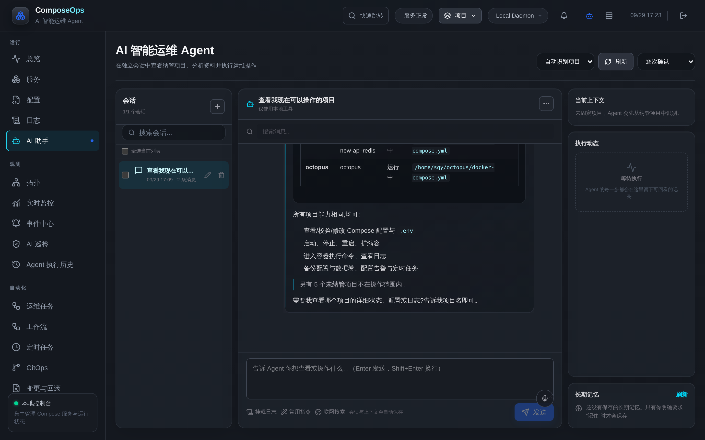
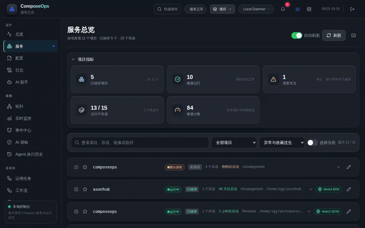
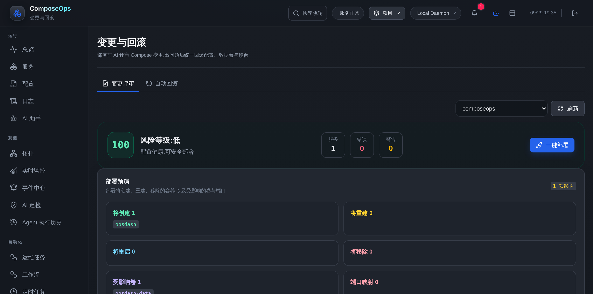
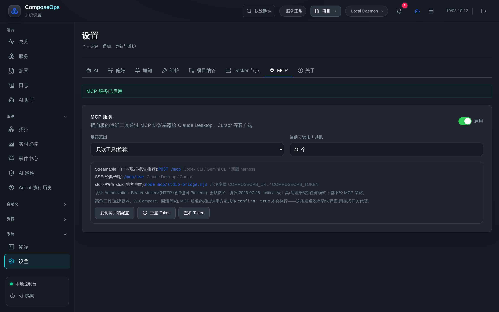
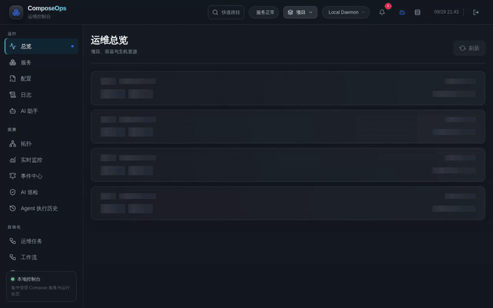
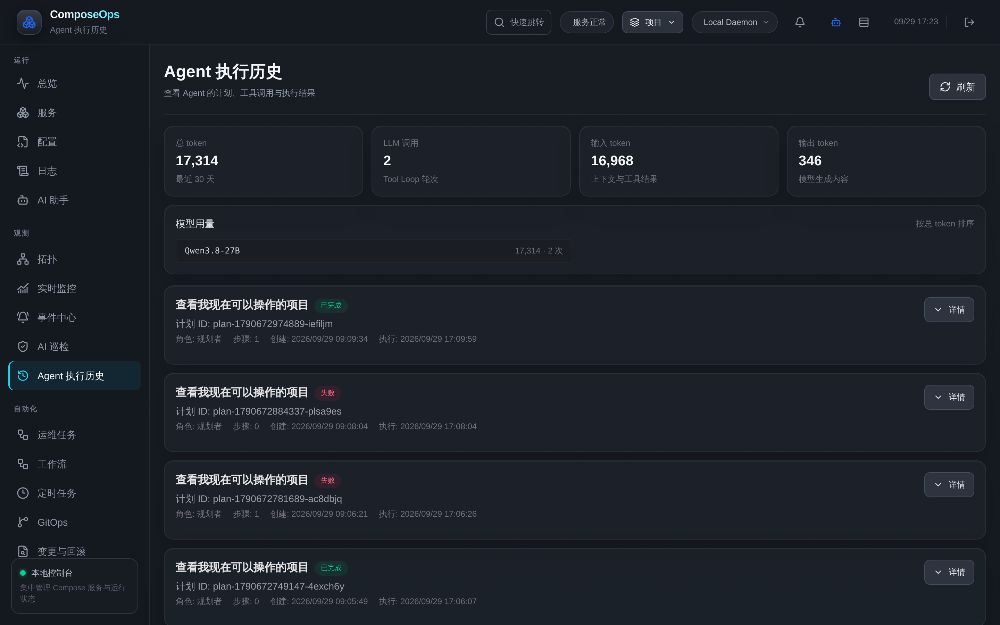
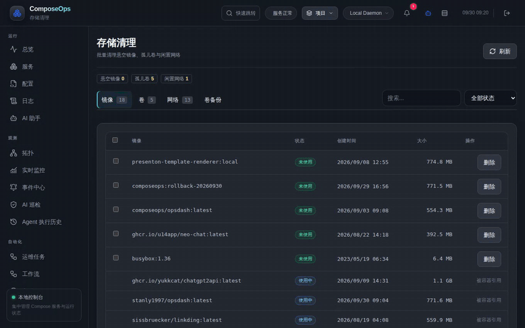
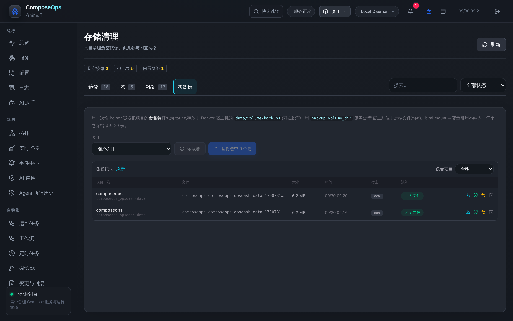
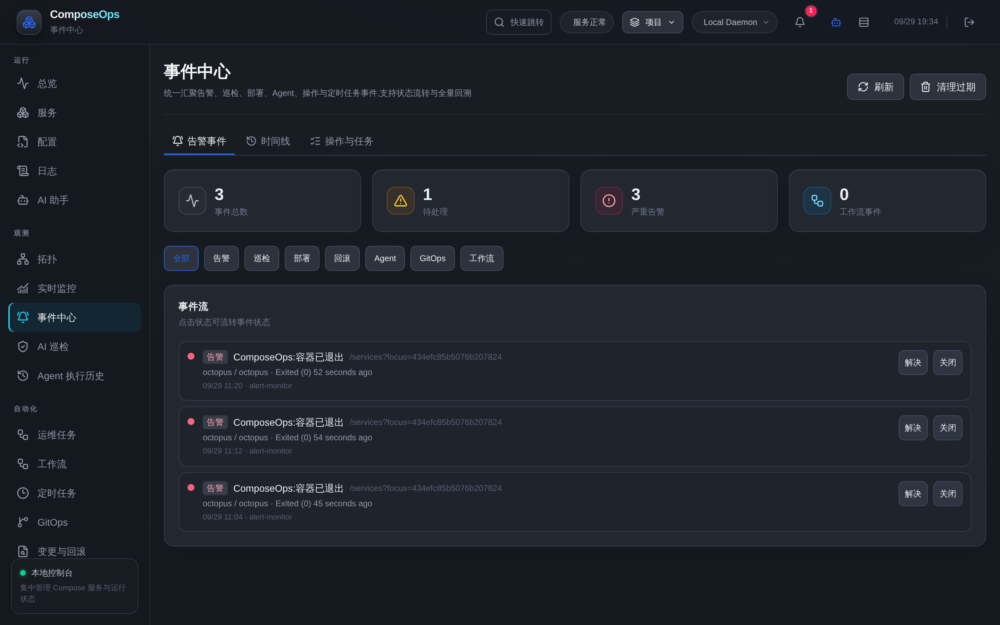
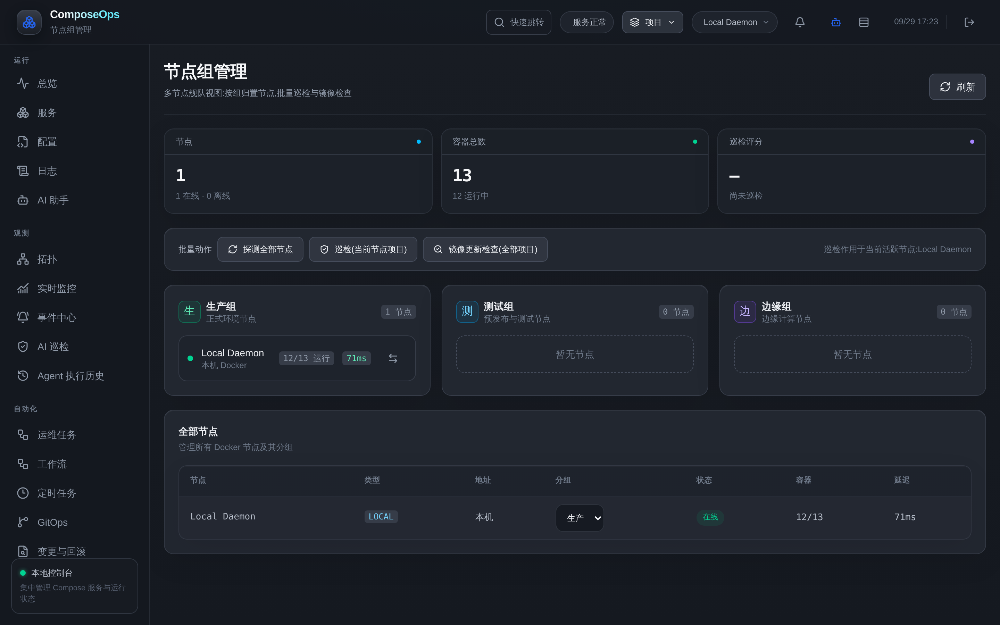

<div align="center">

# ComposeOps

**轻量级 Docker Compose 运维面板，专为个人服务器设计**

[](LICENSE)
[](https://nodejs.org/)
[](https://docs.docker.com/compose/)
[](https://github.com/StanlySGY/ComposeOps/actions/workflows/ci.yml)
[](https://github.com/StanlySGY/ComposeOps/releases)

自动发现 Compose 项目，集成服务控制、配置编辑、实时日志、数据卷备份、GitOps、AI 运维 Agent 与资源监控于单一 Web 界面

[功能特性](#功能特性) • [快速开始](#快速开始) • [AI 运维 Agent](#-ai-运维-agent) • [安全模型](#安全模型) • [English](README.en.md)


<br>


<br>

</div>

> **这是什么**：给自己服务器用的单用户运维面板。Docker Socket 等价 root，界面为中文（英文界面在规划中）。
> **这不是什么**：不支持多租户与团队协作（多人请用 Portainer）；不是 PaaS，不接管构建发布流程（那请看 Coolify / Komodo）。
> **定位**：在这类工具里，ComposeOps 的差异点是 **AI 运维 Agent**——不止能看，还能在你确认后替你动手排障。

[在线交互预览](https://stanlysgy.github.io/ComposeOps/) · [备份与恢复](docs/public/BACKUP_RESTORE.md)

预览直接使用真实应用的页面与导航，数据为虚构示例，无需登录，不访问 Docker 或 AI。[预览范围说明](docs/public/PREVIEW.md)。正式部署默认固定版本 1.5.0；AI 为可选功能。

## 🚀 为什么选择 ComposeOps

### AI 驱动，而不只是管理面板

传统 Docker 面板解决的是“看见问题”。

ComposeOps 解决的是：

**发现问题 → 分析原因 → 请求确认 → 执行操作 → 验证结果**

### 两项核心体验

- 🛡 **守护模式**：开启后，每条容器告警自动触发 AI 诊断——读取容器状态与日志、给出根因假设与带风险标注的处置建议，结果落在事件中心，一键展开。面板会自己"值班看告警"，处置决定权仍在你手里。
- 🔮 **部署预言**：执行 `up` 之前，对照宿主真实状态推演这次部署——哪些容器会新建/重建/原地保留、哪些镜像需要拉取、宿主端口是否被其他容器占用、卷与 bind 路径是否就绪、AI 三句话解读风险。





### 30 秒理解价值

| 你想做什么 | ComposeOps |
|-----------|------------|
| 查看服务状态 | ✅ |
| 查看日志 | ✅ |
| 修改 Compose | ✅ |
| AI 分析故障 | ✅ |
| AI 执行修复 | ✅ |
| 告警自动 AI 诊断(守护模式) | ✅ |
| 部署前宿主实况推演 | ✅ |
| 备份还原演练(自证可用) | ✅ |
| 从 Claude/Cursor 调用运维工具(MCP) | ✅ |
| 高危操作审批 | ✅ |
| 长期记忆运维偏好 | ✅ |
| 运维工作流编排 | ✅ |

### 适合什么场景

ComposeOps 面向个人服务器上的 Compose 运维，重点是可审核的 AI 工具执行、日志与配置联动。需要团队权限、多租户或应用构建平台时，请分别评估 [Portainer](https://www.portainer.io/)、[Dockge](https://github.com/louislam/dockge)、[Komodo](https://komo.do/) 和 [Coolify](https://coolify.io/) 的当前版本。本文不对其他产品的能力缺失作保证。

### 🔌 MCP 通用接入:任何 Agent 都能调用面板工具

面板内置 MCP Server(独立 Token,默认只读白名单,critical 工具永不暴露),三种传输覆盖全部主流客户端:

| 传输 | 端点 | 适用客户端 |
|------|------|-----------|
| Streamable HTTP(现行标准) | `POST /mcp` | Codex CLI、Gemini CLI、新版 harness、Claude Code |
| SSE(经典) | `GET /mcp/sse` | Claude Desktop、Cursor、Cline |
| stdio 桥 | `node mcp/stdio-bridge.mjs` | 仅支持 stdio 的客户端(DeepSeek 系 harness 等) |

启用方式:**设置 → MCP → 启用 → 复制客户端配置**,粘贴进任意客户端的 `mcpServers` 即可。只读模式下 32 个运维工具(状态/日志/指标/巡检/GitOps 漂移/告警)即刻可被你常用的 AI 编码助手调用;切到"包含高风险工具"后 48 个工具开放,但 critical 级(清理、部署)在任何模式下都不经此通道。

协议层面同时服务两个时代的客户端:

- **modern**(2026-07-28 起):不再有 `initialize` 握手,版本由每个请求的 `_meta` 声明,`server/discover` 一次性返回支持的版本与 serverInfo,工具带 `readOnlyHint` / `destructiveHint` 注解让客户端自己决定是否弹确认;
- **legacy**(`initialize` 握手):协议版本 2024-11-05 → 2025-11-25 全线支持,旧式网关把点号写成下划线的工具名(`compose_up` 对应 `compose.up`)也能直接调到。

**MCP 通道的确认门**:面板里的高危操作靠确认弹窗把关,MCP 调用方没有 UI,所以高危工具(重建容器、改 Compose、回滚等)必须由调用方显式传 `confirm: true` 才执行,否则只回一句可重试的说明;工具结果先按值级脱敏再截断(24K 保留首尾),容器日志不会灌爆对方上下文。



### 📱 手机远程操控

移动端浏览器直接访问即是完整操控台:响应式布局、底部 Tab 导航、触摸适配。并且是 **PWA**——手机浏览器打开后"添加到主屏幕",即可像原生 App 一样全屏运行(含桌面快捷方式:服务/AI 助手/事件中心/日志)。

> ⚠️ 安全提醒:面板等价宿主 root。手机远程访问请走 Tailscale/WireGuard 或自建 HTTPS 反代,不要把 `0.0.0.0` 端口直接暴露公网;配合告警推送(Bark/Telegram/钉钉/飞书),手机端"收告警 → 看诊断 → 一键处置"的闭环已就绪。

### 📚 公开文档

- WHY_COMPOSEOPS：`docs/public/WHY_COMPOSEOPS.md`
- FAQ：`docs/public/FAQ.md`
- ROADMAP：`docs/public/ROADMAP.md`
- RELEASE_CHECKLIST：`docs/public/RELEASE_CHECKLIST.md`
- DEMO_SCRIPT：`docs/public/DEMO_SCRIPT.md`
- Redis 升级案例：`docs/public/USE_CASE_REDIS.md`
- PostgreSQL 故障恢复案例：`docs/public/USE_CASE_POSTGRESQL.md`

---


## ✨ 功能特性

### 🚀 核心能力（日常运维主链路）

<table>
<tr>
<td width="50%">

**项目管理**
- 🔍 自动发现 Compose 项目（基于容器标签）
- 🌐 多宿主管理：Local / TCP / SSH 节点切换
- 📁 按 `myops.owner` 分组，支持收藏和备注
- 🎯 显式纳管：默认只读，手动授权后开放控制
- 🔐 双级权限：纳管（容器控制）+ Compose（配置编辑）

</td>
<td width="50%">

**配置编辑**
- ✏️ 多文件 YAML 编辑器（Monaco Editor）
- ✅ 实时语法校验（depends_on / 端口冲突 / 缺失镜像）
- 💾 自动备份最近 20 份，支持 diff 和恢复
- 🔍 **保存前变更预览**：Compose 保存、环境变量应用、镜像升级前均展示将新增/重建/重启/移除的容器清单
- 🧾 环境变量文件族：`.env` / `*.env` / `.env.example` 在线编辑

</td>
</tr>
<tr>
<td>

**实时监控**
- 📊 容器 CPU、内存、网络、存储指标
- 📈 实时监控 + 历史指标曲线（7 天自动保留）
- 🔔 告警阈值配置与实时推送
- 💓 服务健康状态卡片

</td>
<td>

**日志与终端**
- 📜 实时日志流（ERROR/WARN 过滤与高亮）
- 🔎 搜索、暂停、下载、多容器聚合
- 🖥️ Web Shell（sh/bash，项目作用域）
- 🚨 异常退出日志自动归档

</td>
</tr>
</table>

### 🤖 AI 运维 Agent

单一对话入口（原独立 AI 诊断页已合并），原生 Tool Loop 执行引擎：

- 🛠️ **50 个工具 + 4 个组合宏**：项目识别 / 启停 / 配置读写与回滚 / 网络与卷 / 安全审计 / 诊断探针 / 维护清理 / 定时任务 / 长期记忆
- ⚠️ **风险分级 + 逐步确认**：高危操作必须确认后才执行，全程审计落库
- 📎 **日志挂载**：勾选容器日志作为排障证据随消息注入（不可信定界块防护）
- 🌐 **联网检索**：可选开关，回答附带参考来源
- 🧠 **长期记忆**：明确授权后记住你的运维偏好
- 🖼️ **富渲染**：Markdown 表格 / 内嵌 HTML / SVG 架构图安全渲染，支持页面内放大查看
- 💬 **工具轨迹**：每个工具调用的请求/执行/结果状态与耗时实时可见
- 📄 全局页面 Agent 抽屉：任意页面唤起，自动携带当前页面上下文
- 🔁 聊天流式输出、会话自动保存、常用指令库

实测动图：列出纳管项目 → 请求重启 → **弹确认门** → 确认后执行并回报退出码：



执行历史与 token 用量（30 天聚合、模型用量分布、每轮工具轨迹）：



### 💾 数据保护

- 🗂️ **Compose 备份**：每次保存自动留档，最近 20 份，diff 预览与一键回滚
- 📦 **数据卷备份**：helper 容器把命名卷打包为 tar.gz（存于宿主机 `data/volume-backups`），支持手动备份、恢复、下载与删除；可作为定时任务自动执行，每卷保留最近 20 份
- 🧪 **备份自证（还原演练）**：备份完不立马信它——tar 完整性校验 + 解进一次性临时卷统计文件数，通过后记录挂"✓ N 文件"标记，全程不碰原卷
- ⏰ **定时任务**：数据库 Dump、Docker 安全/深度清理、镜像更新检查、定时拉取镜像、数据卷备份

实测动图：勾卷 → 备份 → 还原演练，通过后记录挂"✓ 3 文件"标记：





### 🔔 告警与通知

- **多渠道推送**：Bark / Telegram / 企业微信 / 钉钉 / 飞书 / SMTP / Webhook
- **告警类型**：容器退出 / 内存阈值 / Docker 存储告警
- **事件中心**：优先级、已读/静默状态、WebSocket 实时推送



### 🧹 运维工具

- 🛒 **应用市场**：内置常用应用蓝图 + 自定义模板 + **AI 找应用**（联网检索生成可一键部署的模板草稿）
- 🔄 **GitOps**：Compose 配置 Git 仓库自动同步（轮询 + Webhook 触发），历史可回滚
- 🗑️ Docker 清理预览（未使用镜像/缓存/卷）
- 📋 操作历史与审计日志

### 🧩 进阶模块（按需使用，可完全忽略）

以下模块面向"想把运维经验沉淀下来"的重度用户，不用它们不影响核心链路：

- 🛡️ **AI 巡检**：定时对纳管项目做健康巡检，输出诊断报告
- 📝 **变更评审 / 自动回滚**：Compose 变更先评审再生效，异常自动回退
- 🚢 **舰队视图**：节点组聚合总览、全节点并行探测、批量巡检与镜像更新检查
- 🗃️ **资产中心（CMDB）**：Host / 项目 / 容器 / 卷 / 网络统一资产模型 + 依赖关系
- 🕸️ **知识图谱 / 拓扑**：实时数据与 CMDB 两种数据源，可视化项目依赖
- 🔁 **工作流引擎**：trigger / condition / agent / approval / action / verify 节点编排，Agent 可作为工作流节点
- 🎯 **事件中心**：告警 / 巡检 / 部署 / 回滚 / Agent / GitOps 统一事件流与状态流转
- 💰 **成本分析**：基于资源用量的估算（个人服务器场景偏参考性质）



### 💻 交互体验

- ⌨️ 全局快捷键：Cmd/Ctrl+K 命令面板、`?` 快捷键速查、服务页 Vim 风格 j/k 导航
- 🌙 单暗色工业主题：统一设计 token（surface 色阶 + emerald/rose/amber/sky 状态语义）、骨架屏 / 空态 / 错误分级、焦点陷阱与 Esc 分层管理
- 📱 移动端适配：底部导航 + 抽屉式会话、窄屏表格横滑、触摸目标下限与安全区适配
- ⚡ 性能：路由空闲预取、页面 keep-alive 白名单、日志虚拟滚动、WebSocket 断线降级轮询
- 🔄 资源页带"更新于"时间戳，离页回来自动补齐刷新

---

## 🚀 快速开始

### 前置要求

- Docker Engine 20.10+
- Docker Compose v2

### 一键部署

**方式 A：拉取镜像（推荐）**

```bash
mkdir composeops && cd composeops
# 下载固定版本、无需源码构建的安装清单
curl -fsSL https://raw.githubusercontent.com/StanlySGY/ComposeOps/v1.5.0/deploy/compose.yml -o docker-compose.yml
docker compose pull && docker compose up -d
```

> 镜像发布在 Docker Hub `stanly1997/opsdash`（tag：`latest` / 主版本 / 完整版本号）。若你的网络访问 Docker Hub 困难，用方式 B 本地构建（已内置国内镜像源加速）。
>
> 想要"main 上刚合入、还没打版本号"的构建:仓库 Actions 里有 **Publish Image**(手动触发),产出 `edge` 与 `sha-<7位提交>` 两个标签;不改 `latest`,拉到的是哪一版永远可追。

**方式 B：源码构建**

```bash
git clone https://github.com/StanlySGY/ComposeOps.git
cd ComposeOps
docker compose up -d --build
```

打开浏览器访问 **http://<宿主机IP>:28765**（`docker-compose.yml` 默认映射 `0.0.0.0:28765 -> 3001`，可按需改为 `127.0.0.1:28765:3001` 仅本机访问）。

首次访问需设置管理员密码（最少 10 个字符），之后使用 Session Cookie 登录。

配置 AI 能力：进入 **设置 → AI**，添加一个或多个 OpenAI 兼容渠道，每条独立填写 Base URL / API Key / 模型名，按优先级排序。支持故障自动切换、冷却恢复和工具调用测试；也可直接把 New API 配置为渠道。详见[多渠道配置与 New API 接入](docs/ai-channels.md)。

### 远程访问（推荐 Tailscale）

```bash
# 方式 1: Tailscale（推荐）
tailscale serve --bg http://127.0.0.1:28765

# 方式 2: 反向代理（Caddy/Nginx + HTTPS）
# 设置环境变量: TRUST_PROXY=1
```

⚠️ **安全提示**：不要把端口直接暴露到公网；远程访问务必走 VPN 或 TLS 反代。

---

## 🔒 安全模型

### 认证与授权

- ✅ Scrypt 密码哈希（Node.js 原生）+ 登录失败锁定（5 次锁 15 分钟）
- ✅ 30 天 Session（HttpOnly + SameSite=Strict）
- ✅ REST + WebSocket 统一认证，Origin 校验（防 CSRF）
- ✅ GitOps Webhook 独立 Token（未配置即关闭）

### 文件与操作隔离

- ✅ Realpath 校验（防路径穿越）
- ✅ Docker 文件清单交叉验证
- ✅ 白名单操作（up/stop/restart/pull/ps）与只读探针命令白名单
- ✅ 项目级工作容器（按需挂载目录）
- ✅ AI 工具四档权限门（managed/editable/readonly/admin）+ 高危操作确认门
- ✅ 不可信数据护栏：容器日志/检索结果以定界块注入 Prompt，防提示注入
- ✅ 守护模式 fail-closed：AI 自动诊断只读,处置建议不自动执行
- ✅ MCP 出口独立 Token 鉴权,critical 级工具任何模式下不暴露
- ✅ SSH 凭据永不随设置导出;初始设置可选 SETUP_TOKEN 引导令牌防抢注

### API Key 保护

- ✅ 存储于本地 SQLite（文件权限 0600），不随设置导出
- ✅ 界面回显自动掩码
- ⚠️ 数据库文件本身未加密——请确保宿主机访问受控

### 威胁模型

**假设信任**：单用户管理员 + 本地/VPN 部署 + Docker Socket 等价 root

**防护范围**：路径穿越 / 任意命令执行 / 未授权项目访问 / Session 劫持 / AI 提示注入

**设计边界**：不支持多租户隔离，Docker Daemon 妥协即全局妥协

详见 [SECURITY.md](SECURITY.md)

---

## 📦 项目纳管

### 发现与授权

打开"设置 → 项目纳管"，每个自动发现的项目有两个独立开关：

| 权限级别 | 说明 | 允许的操作 |
|---------|------|-----------|
| **纳管** | 现有容器控制 | 启动/停止/重启、日志、终端、AI 诊断 |
| **Compose** | 配置编辑与拉取 | 编辑 YAML、环境变量、创建缺失服务、拉取镜像 |

### 工作容器机制

勾选 **Compose** 后，ComposeOps 按需创建短生命周期工作容器：

```yaml
# 自动创建的临时容器（项目作用域）
docker run -d --rm --name opsdash-ws-myapp \
  -v /var/run/docker.sock:/var/run/docker.sock \
  -v /opt/myapp:/opt/myapp \
  --workdir /opt/myapp \
  stanly1997/opsdash:latest sleep 3600
```

- **复用策略**：90 秒内连续操作无需重建
- **自动清理**：空闲后销毁，取消勾选时立即清理
- **配置调整**：
  - `COMPOSEOPS_WORKSPACE_IDLE_MS`：空闲保留时间（默认 90000 毫秒）
  - `COMPOSEOPS_WORKSPACE_CACHE_MAX`：最多缓存项目数（默认 8）

### 业务标签分组

在业务 Compose 文件中添加归类标签：

```yaml
services:
  web:
    labels:
      myops.owner: Personal  # 在面板中按此分组
```

---

## 📊 指标说明

**容器化部署下的指标范围**：

- **环境 CPU/内存/网络**：ComposeOps 自身容器的命名空间数据
- **容器级指标**：来自 Docker Stats API
- **存储数据**：来自 Docker System DF

> 需要真实宿主机指标？建议单独部署 [node-exporter](https://github.com/prometheus/node_exporter)，而非向 ComposeOps 挂载完整 `/proc` 和 `/sys`。

---

## 🛠️ 开发与测试

### 聚合脚本（推荐）

在仓库根目录一次完成前后端操作：

```bash
npm run install:all   # 安装 backend + frontend 依赖
npm test              # 后端 + 前端全量测试
npm run lint          # ESLint 代码检查
npm run dev:backend   # 后端开发服务器（3001）
npm run dev:frontend  # 前端开发服务器（5173，自动代理 API）
npm run build         # 构建前端生产版本
```

### 独立子目录操作

```bash
# 后端
cd backend
npm install
npm test
npm run dev

# 前端
cd frontend
npm install
npm run dev          # 自动代理 /api 和 /ws 到 3001
npm run build
```

详见 [CONTRIBUTING.md](CONTRIBUTING.md)

---

## 🗂️ 数据存储

- **SQLite 数据库**：`backend/data/opsdash.db`（文件权限 0600；AI 配置、会话、审计、备份记录）
- **Docker 卷持久化**：`opsdash-data`（生产部署）
- **数据卷备份目录**：`backend/data/volume-backups`（可用 `backup.volume_dir` 覆盖）
- **不应提交到 Git**：`*.db`、`*.db-wal`、`*.db-shm`、`.env`、`dist/`

---

## 📄 许可证

本项目采用 [MIT License](LICENSE) 开源。

---

## 🤝 贡献

欢迎提交 Issue 和 Pull Request！

- [贡献指南](CONTRIBUTING.md)
- [行为准则](CODE_OF_CONDUCT.md)
- [架构文档](docs/architecture/README.md)

---

## 🔗 友情链接

- [LINUX DO](https://linux.do/) —— 真诚分享、友好讨论的技术社区，本项目的交流与反馈也发布于此

---

## 🔗 相关链接

- [English Documentation](README.en.md)
- [Security Policy](SECURITY.md)
- [Changelog](CHANGELOG.md)
- [Issue Templates](.github/ISSUE_TEMPLATE/)

---

<div align="center">

**由 ❤️ 打造 · 专为个人服务器设计**

如果这个项目帮到了你，欢迎 ⭐ Star 支持

</div>
