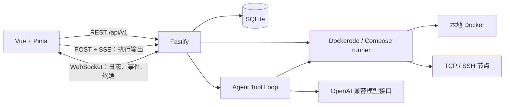

# ComposeOps 架构

按 2026-09-30 的源码整理。ComposeOps 是单用户 Docker Compose 运维台，由 Vue 单页应用、Fastify API、SQLite 和 Docker Engine 组成。[app.js](../../backend/src/app.js) 组装应用，[index.js](../../backend/src/index.js) 监听端口并启动后台调度。

## 组件与通信



| 层 | 实现 |
| --- | --- |
| 前端 | Vue 3.5、Vue Router 5、Pinia 4、Vite 7、Tailwind CSS 4 |
| 编辑与终端 | Monaco、monaco-yaml、xterm |
| 服务端 | Node.js 22+、Fastify 5、ES modules |
| 持久化 | better-sqlite3 |
| Docker | dockerode、Docker Compose CLI、ssh2 |

依赖版本以两侧 package.json 和 lockfile 为准，后端直接运行 JavaScript。

## 页面与状态

路由采用 hash history，例如 `/#/logs?projectId=...&containerId=...`，项目/容器上下文通过 query 传递。完整定义见 [router.js](../../frontend/src/router.js)。

| 页面 | 入口 |
| --- | --- |
| 总览、服务、配置 | `/dashboard`、`/services`、`/compose` |
| 日志、终端、监控 | `/logs`、`/shell`、`/monitor` |
| AI 会话、执行记录、巡检 | `/agent`、`/agent/history`、`/inspection` |
| 事件、工作流、定时任务、GitOps | `/events`、`/workflows`、`/cron`、`/gitops` |
| 运维任务、发布与回滚 | `/ops-center`、`/review` |
| 资产、拓扑、节点组 | `/cmdb`、`/topology`、`/node-groups` |
| 应用市场、存储、成本、设置 | `/marketplace`、`/resources`、`/cost`、`/settings` |

旧 `/ai`、`/blueprints`、`/operations` 分别重定向到 `/agent`、`/marketplace`、`/events`。

前端 [api/client.js](../../frontend/src/api/client.js) 对指定 GET 请求使用内存 SWR：返回缓存并后台刷新，显式强刷等待新响应。成功写入失效缓存，旧请求不能写回被替换的条目。节点切换递增缓存代次并广播 `composeops:host-changed`；页面/store 仍需丢弃迟到响应。

[App.vue](../../frontend/src/App.vue) 通过白名单保活页面。流式或轮询页面应在离开时释放连接/定时器，不能直接加入 keep-alive。Escape 和滚动锁由 `useEscapeKey.js` 统一管理。

## 项目发现与执行

[scanner.js](../../backend/src/services/scanner.js) 从 Compose 标签读取项目名、工作目录和文件列表。Docker 扫描使用 3 秒缓存及同客户端请求合并；返回独立快照，纳管/目录权限和备注每次读取数据库最新值。项目操作结束后主动失效扫描缓存。

[docker-hosts.js](../../backend/src/services/docker-hosts.js) 管理客户端与全局活动节点，选择保存在 `docker.active_host`；活动节点或连接配置变化会通知容器事件订阅迁移。

| 场景 | 执行方式 |
| --- | --- |
| 本地文件已挂载且可编辑 | direct：本地 Compose CLI |
| 本地路径未直挂但处于允许范围 | workspace：按需 runner 访问宿主文件 |
| SSH 节点 | 远端 SSH 读写和执行，mountState=remote_ssh |
| 只有 TCP Docker API | containers：现有容器控制，不编辑远端 Compose 文件 |

managed 是操作前提，mountEnabled 和路径范围共同决定编辑能力。[project-action-runner.js](../../backend/src/services/project-action-runner.js) 为 API、工作流和 Agent 提供入口，通过项目锁串行化同一项目的操作。

Compose 操作用 POST 请求读取 SSE 输出，不使用 EventSource 自动重连；连接结束必须明确处理，避免重放写操作。

## 日志、事件与终端

- [docker-log-stream.js](../../backend/src/services/docker-log-stream.js) 按 TTY 配置区分原始流和 Docker 多路复用帧。单容器/聚合日志共用 UTF-8 解码、完整行组装、时间戳和级别解析。
- [container-events.js](../../backend/src/services/container-events.js) 按完整 JSON 行解析 Docker Events，串行处理，断线重试，无订阅者时停止连接。
- [routes/ws.js](../../backend/src/routes/ws.js) 在初始化前登记关闭处理，断连后销毁迟到流。终端先预留会话槽位，再缓冲初始化期间的输入和窗口尺寸。
- 日志页暂停显示时仍接收数据；缓冲有上限并展示丢弃数量。流结束和连接错误分别展示，结束后不自动重连并重复历史。

## Agent 单通道

工作台和抽屉共用 [useAgentChat.js](../../frontend/src/composables/useAgentChat.js)。执行入口为 `POST /api/v1/ai/agent/execute-stream`，审批入口为 `POST /api/v1/ai/agent/approve`；日志页的 `POST /api/v1/ai/diagnose` 独立保留。

Tool Loop 每轮调用模型，解析工具调用，检查权限/风险/审批，回传结果后继续。入口在 [agent.js](../../backend/src/services/agent.js) 和 [engine.js](../../backend/src/services/agent/engine.js)，工具名、数量及权限以注册表为准。

- 历史由后端读取。ai_sessions.compacted_before_id 标记模型活跃窗口，compact_summary 存摘要；渲染仍读取全量历史。
- approval-gate 支持 ask、allow_writes、full；critical 始终确认，会话记忆不能绕过。
- secret-redactor 收集敏感值并脱敏出站文本，日志/文件/页面上下文作为不可信证据。
- background-tasks 支持后台任务与完成通知，runaway-guard 检测重复动作；空模型轮次最多提醒重试一次。
- SSE token 的协议清理由后端有状态发射层完成，前端原样追加；逐 token trim 会破坏 Markdown 空白和换行。

## 数据与认证

结构和迁移的唯一来源是 [lib/db.js](../../backend/src/lib/db.js)，不要另写一份建表脚本。

| 数据域 | 主要表 |
| --- | --- |
| 配置与认证 | settings、sessions |
| 项目与备份 | project_preferences、compose_backups、volume_backups |
| 会话与用量 | ai_sessions、ai_history、ai_memories、ai_usage |
| 操作与执行 | operation_history、agent_plans、agent_executions、background_jobs |
| 观测与资产 | container_metrics、inspections、alert_events、event_records、assets、asset_relations |
| 工作流 | workflow_definitions、workflow_instances、workflow_steps |

[lib/auth.js](../../backend/src/lib/auth.js) 用 scrypt 存管理员密码哈希；会话令牌只存哈希，cookie 使用 HttpOnly、SameSite=Strict 和 30 天有效期。写请求检查 Origin，WebSocket 也要求认证。设置中的 API Key/SSH 凭据不等于数据库加密；展示脱敏与导出过滤是另外的控制。

命名卷备份使用短生命周期 helper 生成 tar.gz，支持下载、临时卷演练、还原和保留策略。删除归档失败时保留数据库记录以便重试。

## 验证与运行

```sh
# 仓库根目录；后端 test 已固定 --test-concurrency=1
DB_PATH=/tmp/composeops-test.db npm run test:backend
npm run test:frontend
npm run lint
npm run build
```

端口和部署参数以现有配置为准，此次没有修改 `0.0.0.0:28765:3001`。实测与边界见 [审查记录](../audit-2026-09-29.md)。
